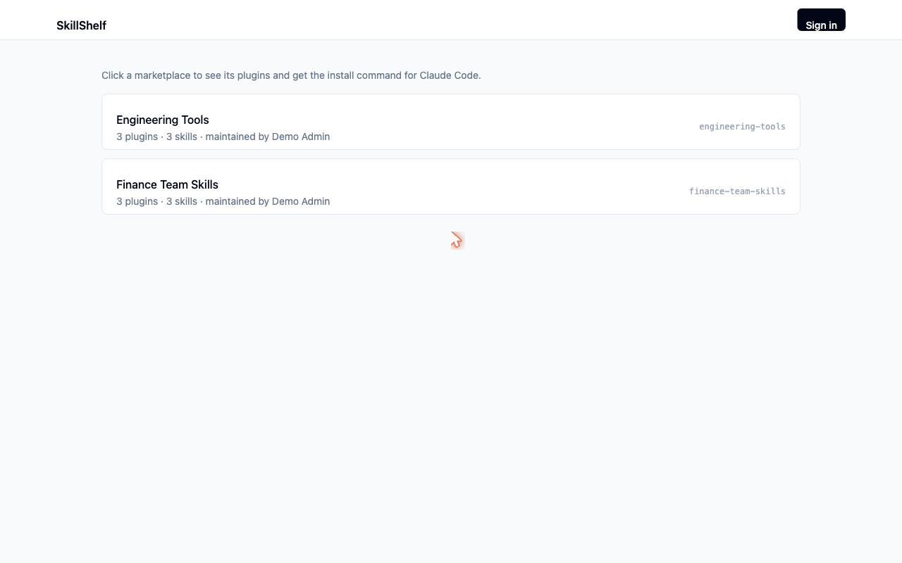
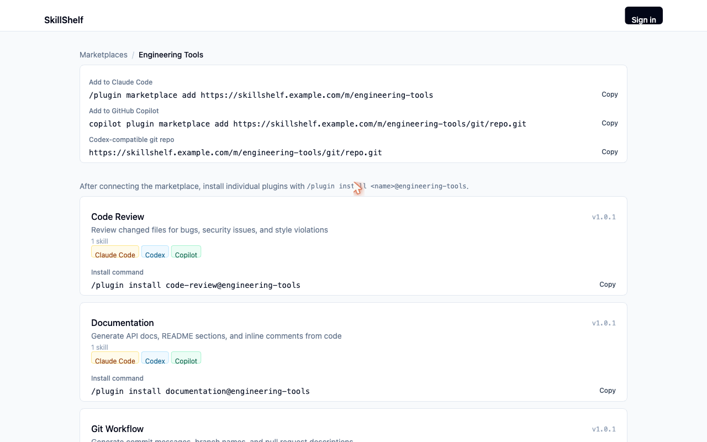

# SkillShelf

SkillShelf is a self-hostable web app for creating and managing Claude Code and Codex plugin marketplaces. Teams create a marketplace, add installable plugins, attach guided components, and share one marketplace URL without asking plugin authors to touch git.

<p align="center">
  
</p>

<p align="center">
  
</p>

## Quick Start

Requirements:

- Docker
- Docker Compose

```sh
cp .env.example .env
docker compose up --build
```

Open the app at:

```text
http://localhost/
```

Set `PUBLIC_BASE_URL` in `.env` to the URL your AI coding agents can reach. SkillShelf embeds this value in every `marketplace.json`, so production deployments should use the public HTTPS origin.

## Basic Use

1. Open SkillShelf and go to `/manage`.
2. Create a marketplace for a team or workflow area.
3. Create a plugin inside that marketplace.
4. Add skills, hooks, agents, MCP servers, commands, monitors, or default settings to the plugin.
5. Copy the Claude Code connect snippet from the marketplace page:

```text
/plugin marketplace add https://your-server.example.com/m/<marketplace-slug>
```

6. Install plugins from that marketplace in Claude Code.

Skill-bearing plugins also include Codex-compatible metadata in the generated git repo. Claude-only components such as hooks, agents, MCP servers, commands, monitors, and settings are rendered for Claude Code and are not represented in Codex metadata.

## Deployment

The default Docker Compose setup stores SQLite metadata and per-marketplace git repos in a named Docker volume mounted at `/var/lib/skillshelf`.

For production, put SkillShelf behind HTTPS and set:

```sh
PUBLIC_BASE_URL=https://your-server.example.com
SKILLSHELF_DATA_DIR=/var/lib/skillshelf
NODE_ENV=production
SKILLSHELF_SESSION_SECRET=<long-random-secret>
```

Organization admins configure login providers at `/organization/auth`. Provider client secrets are referenced by environment variable name, for example `SKILLSHELF_GITHUB_CLIENT_SECRET`, and are not stored in SQLite.

When running the backend directly for local development, use a writable local path such as `SKILLSHELF_DATA_DIR=../.skillshelf-data`.

See [Deployment](docs/DEPLOYMENT.md) for volume, reverse proxy, and backup notes.

## Security

SkillShelf is currently intended for trusted internal networks and trusted plugin authors. Hooks, MCP servers, and monitors may execute commands on users' machines after installation, so do not expose a v1 deployment as a public marketplace.

## Roadmap

- Multi-organization SaaS features such as organization switching, membership lifecycle, and billing.
- Audit logs and approval workflows for plugin changes.
- Safer review and signing flows for executable components like hooks, MCP servers, and monitors.
- Cloud deployment hardening: backups, restore docs, health checks, metrics, and managed storage options.
- Claude Code client acceptance testing beyond the automated verification harness.

SkillShelf is not a replacement for Claude skills or MCP servers. It is the management and distribution layer that packages those artifacts into Claude/Codex-compatible plugin marketplaces.

## Development

Development setup, test commands, and the verification harness live in [Development](docs/DEVELOPMENT.md).

## License

SkillShelf is licensed under [Apache-2.0](LICENSE), a permissive license with an explicit patent grant.
